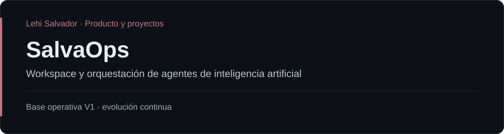

# SalvaOps

SalvaOps nació como un workspace local para Windows que reúne proyectos, contexto, documentación, terminales y herramientas de desarrollo asistido por IA. Evoluciona hacia una capa de orquestación y gobierno de agentes.

## Participación

Lehi Salvador — definición de producto y arquitectura. El objetivo es expresar qué debe construirse y sus restricciones, mientras herramientas y agentes especializados resuelven ejecución con contexto y evidencia.

## Alcance

- Administración de proyectos, documentación, contexto y terminales.
- Integración del trabajo con Claude Code y Codex.
- Agentes reutilizables, Skills, MCPs y workflows.
- Coordinación de integraciones con GitHub, Vercel y Supabase.
- Gestión de credenciales, evidencia, aprobaciones y auditoría como parte del modelo de gobierno.

## Estado y contexto

Existe una **base operativa V1**. La orquestación y gobierno de agentes continúan evolucionando. Este repositorio reúne la presentación pública, propósito y alcance del proyecto.

## Tecnologías

Windows, Claude Code, Codex, agentes de IA, Skills, MCPs e integraciones con GitHub, Vercel y Supabase.

## Enlaces

- [Portafolio de Lehi Salvador](https://github.com/LehiSalvador)
- [Salva Systems](https://salvasystems.site)
